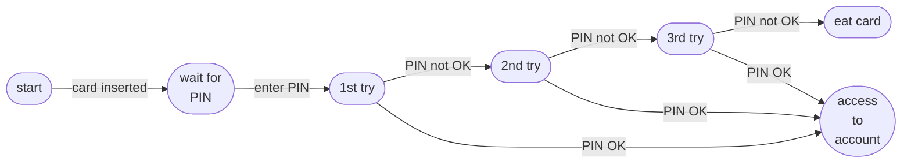

# Test Design Techniques Skill

Reference for QA Engineer agent. For each feature, select techniques based on what type of logic is being tested. Each technique: what it is, when to use, how to apply, and concrete checklist examples.

---

# 1. Equivalence Partitioning (EP)

## What

Divide input data into groups (partitions) where all values in the group are expected to behave identically. Test one representative value per partition instead of every possible input.

**Quantity of tests must be equal to quantity of partitions.**

**For non-numeric partitions** (file types, roles, statuses, etc.): if requirements list multiple valid values explicitly, test them as one valid partition — not individually. Write the test using "A or B or C" form.

**Only use partitions explicitly defined or implied by the requirements. Do not invent invalid, empty, or edge-case partitions — those are covered by Error Guessing. Exception: for naturally bounded inputs (Age, Quantity, Length, Size) that cannot be negative, 0 is an implied lower boundary even if not stated explicitly.**

## Example 1: Only users with Age field from 18 to 65 years are able to sing up in the system. Users with Age less than 18 or greater than 65 see an error message.

**Partitions**:
- 0 ≤ Age < 18
- 18 ≤ Age ≤ 65
- Age > 65

**Tests**:
- User with Age = 10 sees error message and cannot sign up
- User with Age = 36 is successfully signed up
- User with Age = 80 sees error message and cannot sign up

## Example 2: User can add avatar in png, jpg or jpeg formats. Other formats are unsupported and error message appears.

**Partitions**:
- files in png, jpg or jpeg format
- files not in png, jpg or jpeg format

**Tests**:
- User can successfully add avatar in png, jpg or jpeg format
- When user tries to add avatar not inpng, jpg or jpeg format error message appears

---

# 2. Boundary Value Analysis (BVA)

## What

Errors cluster at the boundaries between partitions. Test the exact boundary values, one below, and one above — not just a value in the middle.

**Only use partitions explicitly defined or implied by the requirements. Do not invent invalid, empty, or edge-case partitions — those are covered by Error Guessing. Exception: for naturally bounded inputs (Age, Quantity, Length, Size) that cannot be negative, 0 is an implied lower boundary even if not stated explicitly.**

For a range [min, max], always test: `min-step`, `min`, `min+step`, `max-step`, `max`, `max+step`, where step defined by the input type.

**If step cannot be defined from the requirements use the following values**:
- step for double values (like currency or file size) values is 0.01
- step for integer values (like age or length) is 1
- step for date is 1 day
- step for time is 1 minute

## Example 1: Only users with Age field from 18 to 65 years are able to sing up in the system. Users with Age less than 18 or greater than 65 see an error message.

**Partitions**:
- 0 ≤ Age < 18
- 18 ≤ Age ≤ 65
- Age > 65

**Tests**:
- User with Age = 0 sees error message and cannot sign up
- User with Age = 1 sees error message and cannot sign up
- User with Age = 17 sees error message and cannot sign up
- User with Age = 18 is successfully signed up
- User with Age = 19 is successfully signed up
- User with Age = 64 is successfully signed up
- User with Age = 65 is successfully signed up
- User with Age = 66 sees error message and cannot sign up

## Example 2: User can transfer money from his card if the amount does not exceed its actual balance. Otherwise, he sees an error message.

**Partitions**:
- Amount ≤ Balance
- Amount > Balance

**Tests**:
- User can successfully transfers amount of `Balance-0.01` from his card
- User can successfully transfers amount of `Balance` from his card
- User cannot transfer amount of `Balance+0.01` from his card and sees error message

## Example 3: Users who regisered in the system before 23 June, 2000 have discount of 10% for their purchases.

**Partitions**:
- Registration Date < 23 June, 2000
- Registration Date ≥ 23 June, 2000

**Tests**:
- User with Registration Date = `22 June, 2000` has discount of 10%
- User with Registration Date = `23 June, 2000` doens't have discount of 10%
- User with Registration Date = `24 June, 2000` doens't have discount of 10%

---

# 3. Decision Table Testing

## What

Model complex business logic where multiple conditions combine to produce different outcomes. Each column is a unique combination of conditions → one test case.
Best for: "if A and B but not C, then result X; if A but not B, then result Y".

**Two types of decision table can be used:**
- Limited-entry decision table if conditions are boolean values (true or false)
- Expected-entry decision table if at least 1 condition isn't a boolean value (ex: condition `Day of week` takes 7 values `Sun`, `Mon`, `Tue`, `Wed`, `Thu`, `Fri`, `Sat`)

## Example (Limited-entry decision table): Persons that study at a university and have parents whose total annual income is less than €30.000, receive a scholarship. In addition to these qualifications, if they also live away from home, they receive an addition to their scholarship.

**Conditions**:
- Study at a university?
- Annual income less than €30.000?
- Live away from home?

**Resulting actions**:
- Receive a scholarship
- Receive an addition

**Limited-entry decision table**:

Full decision table contains all combinations for the conditions.

| Condition / Action | TC1 | TC2 | TC3 | TC4 | TC5 | TC6 | TC7 | TC8 |
|--------------------|-----|-----|-----|-----|-----|-----|-----|-----|
| **Study at a university?** | 0 | 0 | 0 | 0 | 1 | 1 | 1 | 1 |
| **Annual income less than €30.000?** | 0 | 0 | 1 | 1 | 0 | 0 | 1 | 1 |
| **Live away from home?** | 0 | 1 | 0 | 1 | 0 | 1 | 0 | 1 |
| **→ Receive a scholarship** | | | | | | | X | X |
| **→ Receive an addition** | | | | | | | | X |

**Collapced Decision Table**:

To collapse the table:
1. Remove all columns with impossible combinations for conditions (no any impossible combinations in the table above).
2. Collapce columns with identical set of Actions (ex: TC1 and TC2 in the table above has identical values for Receive a scholarship and Receive an addition actions. For these test cases we have different values for Live away from home condition. It means that this condition doesn't influence on the resulting actions and it is possible to collapce TC1 and TC2 into 1 test where Live away from home is `any`).
3. Repeat point 2 while there are columns that can be collapced.

Note: a column where ALL conditions are `any` is invalid - at least one condition must have a specific value.

| Condition / Action | TC1 | TC2 | TC3 | TC4 |
|--------------------|-----|-----|-----|-----|
| **Study at a university?** | 0 | 1 | 1 | 1 |
| **Annual income less than €30.000?** | any | 0 | 1 | 1 |
| **Live away from home?** | any | any | 0 | 1 |
| **→ Receive a scholarship** | | | X | X |
| **→ Receive an addition** | | | | X |

**Tests**:
- TC1 -> Person who doesn't study at a university doesn't receive a scholarship and an addition to to their scholarship
- TC2 -> Person who studies at a university and whose parents annual income is not less than €30.000 doesn't receive a scholarship and an addition to to their scholarship
- TC3 -> Person who studies at a university, whose parents annual income is less than €30.000 and who doesn't live away from home receives a scholarship but doesn't receive an addition to to their scholarship
- TC4 -> Person who studies at a university, whose parents annual income is less than €30.000 and who lives away from home receives a scholarship and an addition to to their scholarship

## Example (Expected-entry decision table): As a Regular or Special user, I want to be able to use my electronic floor card, to access specific floors. Acceptance Criteria: AC1: Regular users have access to floors 1 to 3. AC2: Floor 4 is only accessible to Special users. AC3: Special users have all the access rights of Regular users. AC4: Error is shown if no access.

**Conditions**:
- User = {Regular, Special}
- Floor = {1-3, 4}

**Resulting actions**:
- Access granted
- Error

**Expected-entry decision table**:

Full decision table contains all combinations for the conditions.

| Condition / Action | TC1 | TC2 | TC3 | TC4 |
|--------------------|-----|-----|-----|-----|
| **User** | Regular | Regular | Special | Special |
| **Floor** | 1-3 | 4 | 1-3 | 4 |
| **→ Access granted** | X |  | X | X |
| **→ Error** |  | X |  |  |

**Collapced Decision Table**:

To collapse the table:
1. Remove all columns with impossible combinations for conditions (no any impossible combinations in the table above).
2. Collapce columns with identical set of Actions (ex: TC1 and TC3 in the table above has identical values for Access granted and Error actions. For these test cases we have different values for User condition. It means that this condition doesn't influence on the resulting actions and it is possible to collapce TC1 and TC3 into 1 test where User is `any`).
3. Repeat point 2 while there are columns that can be collapced.

Note: a column where ALL conditions are `any` is invalid - at least one condition must have a specific value.

| Condition / Action | TC1 | TC2 | TC3 |
|--------------------|-----|-----|-----|
| **User** | any | Regular | Special |
| **Floor** | 1-3 | 4 | 4 |
| **→ Access granted** | X |  | X |
| **→ Error** |  | X |  |  |

**Tests**:
- TC1 -> Any user can access Floors 1-3
- TC2 -> Regular user cannot access Floor 4, he sees error
- TC3 -> Special user can access Floor 4

---

# 4. State Transition Testing

## What

Model an entity that moves through defined states in response to events/actions. Test valid transitions and invalid transitions.

## Example: There is a system that is responsible for checking the PIN code when you want to withdraw money from an ATM or check your balance. User inserts his card, enters PIN code. If the PIN is correct he is able to access his account. If not, user has 2 more tries to enter correct PIN. If PIN is incorrect for the 3rd time, the ATM eats the card.



**States**:
- start
- wait for PIN
- 1st try
- 2nd try
- 3rd try
- access to account
- eat card

**Events**:
- card inserted
- PIN entered
- PIN is OK
- PIN is not OK

**Valid Transitions**:
- start -> (card inserted) -> wait for PIN -> (PIN entered) -> 1st try -> (PIN is OK) -> access to account
- start -> (card inserted) -> wait for PIN -> (PIN entered) -> 1st try -> (PIN is not OK) -> 2nd try -> (PIN is OK) -> access to account
- start -> (card inserted) -> wait for PIN -> (PIN entered) -> 1st try -> (PIN is not OK) -> 2nd try -> (PIN is not OK) -> 3rd try -> (PIN is OK) -> access to account
- start -> (card inserted) -> wait for PIN -> (PIN entered) -> 1st try -> (PIN is not OK) -> 2nd try -> (PIN is not OK) -> 3rd try -> (PIN is not OK) -> eat card

**Invalid Transitions**:
- start -> (enter PIN)                                                                                                         
- start -> (PIN is OK)                                                                                                         
- start -> (PIN is not OK) 
- wait for PIN -> (card inserted)                                                                                            
- wait for PIN -> (PIN is OK)    
- wait for PIN -> (PIN is not OK)
- 1st try -> (card inserted)
- 1st try -> (enter PIN) 
- 2nd try -> (card inserted)                                                                                                 
- 2nd try -> (enter PIN) 
- 3rd try -> (card inserted)                                                                                                   
- 3rd try -> (enter PIN)
- access to account -> (card inserted)
- access to account -> (enter PIN)    
- access to account -> (PIN is OK)
- access to account -> (PIN is not OK) 
- eat card -> (card inserted)                                                                                                  
- eat card -> (enter PIN)    
- eat card -> (PIN is OK)                                                                                                      
- eat card -> (PIN is not OK)

**Tests that covers valid transitions**:
- User inserts his card and enters correct PIN from the 1st try -> he has access to his account
- User inserts his card and enters correct PIN from the 2nd try -> he has access to his account
- User inserts his card and enters correct PIN from the 3rd try -> he has access to his account
- User inserts his card and enters incorrect PIN 3 times in a row -> his card is eaten


**Tests that covers invalid transitions**:
> *(Define most realistic invalid transitions and add test)*
- User enters his PIN without inserting his card (no any reaction from the ATM side)
- User inserts his card and just after that inserts one more card (the ATM doesn't accept it)
- User enter correct PIN from the 1st try and inserts one more card (the ATM doesn't accept it)
- User enter correct PIN from the 2nd try and inserts one more card (the ATM doesn't accept it)
- User enter correct PIN from the 3rd try and inserts one more card (the ATM doesn't accept it)
- User enters incorrect PIN 3 times in a row (card is eaten) and inserts one more card (the ATM waits for PIN)

---

# 5. Pairwise Testing

## What

When there are many parameters with multiple values, testing all combinations is impossible (N^K explosion). Pairwise guarantees that every pair of parameter values appears in at least one test case — catching ~75% of defects with ~10-20% of test cases.

To generate pairwise combinations, use a pairwise algorithm or tool (e.g. PICT, AllPairs). After generating, verify manually that every pair of parameter values appears in at least one test case.

Note: Pairwise does not guarantee a happy path test case - add it separately if not generated.

## Example: For success registration in the system user should fill Name, Age and Weight. Name cannot be empty and should have length from 3 to 30 characters (any characters). Age cannot be empty, range from 12 to 65 is acceptable (type is integer). Weight cannot be empty, range from 34 to 260 is acceptable (type is double). If user enters unacceptable value into 1 or more fields error message is shown. The same error is shown when user doesn't fill 1 or more fields.

**Parameters and values** (EP technique is applied to define values):
- Name (values: strings with length 0..2, strings with length 3..30, strings with length 31+)
- Age (values: empty, integer 0..11, integer 12..65, integer 66+, not integer)
- Weight (values: empty, double from 0.0 to 33.99, double from 34.0 to 260.0, double 260.01+, not double).

**Tests** (every pair of values is tested at least once):
- Try to register user with Name length 0..2, leave Age empty, leave Weight empty -> Error message is shown
- Try to register user with Name length 0..2, Age 0..11, Weight from 0.0 to 33.99 -> Error message is shown
- Try to register user with Name length 0..2, Age 12..65, Weigth from 34.0 to 260.0 -> Error message is shown
- Try to register user with Name length 0..2, Age 66+, Weight	260.01+ -> Error message is shown
- Try to register user with Name length 0..2, Age not integer, Weight not double -> Error message is shown
- Try to register user with Name length 3..30, Age 0..11, Weight from 34.0 to 260.0 -> Error message is shown
- Try to register user with Name length 3..30, Age 12..65, Weight 260.01+ -> Error message is shown
- Try to register user with Name length 3..30, Age 66+, Weight not double -> Error message is shown
- Try to register user with Name length 3..30, Age not integer, empty Weigth -> Error message is shown
- Try to register user with Name length 3..30, empty Age, Weight from 0.0 to 33.99 -> Error message is shown
- Try to register user with Name length 31+, Age 12..65, Weight not double -> Error message is shown
- Try to register user with Name length 31+, Age 66+,	empty Weight -> Error message is shown
- Try to register user with Name length 31+, Age not integer, Weight from 0.0 to 33.99 -> Error message is shown
- Try to register user with Name length 31+, empty Age, Weight from 34.0 to 260.0 -> Error message is shown
- Try to register user with Name length 31+, Age 0..11, Weight 260.01+ -> Error message is shown
- Try to register user with Name length 0..2, Age 66+, Weight from 0.0 to 33.99 -> Error message is shown
- Try to register user with Name length 0..2, Age	not integer, Weight from 34.0 to 260.0 -> Error message is shown
- Try to register user with Name length 0..2,	empty Age, Weight 260.01+ -> Error message is shown
- Try to register user with Name length 0..2, Age 0..11, Weight not double -> Error message is shown
- Try to register user with Name length 0..2, Age 12..65,	empty Weight -> Error message is shown
- Try to register user with Name length 3..30, Age not integer, Weight 260.01+ -> Error message is shown
- Try to register user with Name length 3..30, empty Age, Weight not double -> Error message is shown
- Try to register user with Name length 3..30, Age 0..11,	empty Weight -> Error message is shown
- Try to register user with Name length 3..30, Age 12..65, Weight from 0.0 to 33.99 -> Error message is shown
- Try to register user with Name length 3..30, Age 66+, Weight from 34.0 to 260.0 -> Error message is shown

---

# 6. Error Guessing

## What

Use experience, intuition, and domain knowledge to predict where defects are likely to be — without a formal model. Fills the gaps left by systematic techniques.

## Categories of Errors to Guess

### Input & Data
- Empty / null / undefined / whitespace-only
- Maximum length exceeded, minimum not reached
- Special characters: `<`, `>`, `"`, `'`, `&`, `\`, `/`, `%`, `null` as string, `undefined` as string
- SQL/XSS injection strings: `'; DROP TABLE users;--`, `<script>alert(1)</script>`
- Unicode edge cases: emoji 🎉, RTL text (Arabic), zero-width characters, surrogate pairs
- Numeric edge cases: 0, -1, very large numbers (int overflow), float precision (`0.1 + 0.2`)
- Date edge cases: 29 Feb (non-leap year), timezone boundaries, DST change day, past dates, far future dates

### File Uploads
- Zero-byte file
- File with wrong extension (rename `.exe` to `.jpg`)
- File without extension
- Filename with special characters or spaces
- Duplicate filename
- Corrupted file (truncated, wrong magic bytes)
- Extremely long filename

### API & Network
- Missing required fields in request body
- Extra unknown fields in request body (should be ignored)
- Wrong Content-Type header
- Duplicate request (idempotency)
- Very large payload
- Malformed JSON/XML
- Expired or revoked auth token
- Request replay (same token, different user context)

### Authentication & Sessions
- Login with correct credentials after failed attempts (lockout recovery)
- Access resource after session expires
- Use refresh token twice (rotation check)
- Simultaneous login from 2 devices
- Password reset token used twice
- Password reset token after password already changed

### Concurrency & Race Conditions
- Submit the same form twice rapidly (double-click)
- Two users performing the same write operation simultaneously
- Place order and cancel simultaneously
- Apply two mutually exclusive promotions at the same time

### Async & Integration
- External API returns 500 / timeout / malformed response
- Message processed twice (broker re-delivery)
- Webhook arrives before the related entity is created
- Partial failure mid-transaction (DB write succeeds, event dispatch fails)

### UI & UX
- Browser back button after completing a multi-step form
- Refresh page in the middle of a wizard
- Copy-paste values with leading/trailing spaces
- Very long text that overflows UI layout
- Rapid tab switching or navigation

---

# 7. Checklist-based Testing

## What

Use pre-defined checklists.

## Checklists for different cases

### A/B testing (distribution takes place on the Backend)
- A new A/B test is created in the admin panel with the correct name
- All split groups possible for entry have been added, with correct names and the percentage of users who can enter
- Users are assigned to the A/B test at the split point(e.g. after choosing best fit program, after first login etc.) according to the requirements
- Only new users are included in the A/B test if defined in the requirements
- Old users are excluded from the A/B test  if defined in the requirements
- Only users meeting all test requirements are included
- Check that if each individual requirement is not met, users do not enter the AB test
- If the test is configured for only one platform, it does not trigger on the other platform
- If the test is configured for both platforms, users are assigned correctly on both iOS and Android
- Users are distributed evenly across groups (e.g., 50/50, 33/33/34) if configured so
- Users are not redistributed into AB test if they hit the distribution point again
- Users are not reassigned to the AB test upon re-login
- For the AB test platform, it is possible to define the minimum application version from which users will be included in the distribution
- When setting the version to 0.0.0 all users will be included in the AB test, regardless of their app version
- When group A is rolled out 100%, all new target users see group А; users already in group B remain in group B
- When group B is rolled out 100%, all new target users see group B; users already in group A remain in group A
- When AB test is disabled, no new users are distributed to the test
- [Database] New A/B test exists in the split table with correct values (name, enabled, site_id for bodyfit, started_at, ended_at, etc.)
- [Database] All test groups exist in the split_group table
- [Database] Group distribution percentages are correctly displayed in the split_group table
- [Database] If a user is assigned to the test, a new record is created in user_split_group with the correct user_id and split_group_id
- [Database] Only one record per split exists for each user in user_split_group
- [API,  if features/availability is used] For a user in the test group, the features/availability endpoint returns a feature access field with value true
- [API,  if features/availability is used]  For a user in the default group, the features/availability endpoint returns the feature access field with value false
- [API,  if features/availability is used] For a user not in the A/B test, the features/availability endpoint returns the feature access field with value false
- [API bodyfit] If the user is in the A/B test, their split group is correctly returned in the response of GET api/mobile/v3.0/user-profile
- [API HA] If the user is in the A/B test, their split group is correctly returned in the response of GET api/v1/user/split-groups

### A/B testing (distribution takes place on the iOS/ Android side)
- Config for A/B test has correct structure in remote config
- User Distribution when enabled = true (A/B test active)
- [Analytics]: splitExp is correctly sent when the test is active (enabled = true) (e.g. catalogNewTab|A for Control Group, catalogNewTab|B for Test Group)
- Winner rollout groups are applied only when enabled = false (A/B test inactive)
- [Analytics]: splitExp is no longer sent after the test is completed (enabled = false)
- "winnerRollout": "newUser" option
- "winnerRollout": "ABTestAndNewUsers" option
- "winnerRollout": "allUsers" option

### API testing
- API documentation is up to date
- Missing Authorization header for protected endpoints
- Empty Authorization header for protected endpoints
- Invalid Authorization header for protected endpoints
- Expired Authorization header for protected endpoints
- Access token of REGULAR_USER and ANONYMOUS_USER in the Authorization header for protected endpoints
- Perfomance (response time is less than 500 ms)
- Errors handling (missing/ invalid data in the request body, missing/ invalid headers, missing/ invalid query string parameters)

### iOS/ Android apps testing
- Dark/ Light theme
- Different screen resolutions (small, medium, large)
- Different OS versions (iOS, Android)
- UI/UX consistency (font, alignment, button style)
- Scrolling works as expected
- Pagination works as expected
- Performance (screen is fully rendered during 2-3 seconds)
- Connectivity (no internet connection, slow internet connection, WiFi/ Mobile internet)
- Skeleton is used when loading takes some time
- No excessive caching on the screens
- Integration with API Service (handling of errors, no double calls to the same API endpoint etc.)
- Navigation back (Back button, swiping back) for all the screens from the requirements
- User closes the app in the middle of the flow
- User backgrounds and foregrounds the app in the middle of the flow
- User re-installs the app
- User updates the app
- Permissions are handled correctly (the app asks for Notifications, Location, Camera, Storage and so on permissions)
- Localization (translations exist, texts are too long/ too short, date/ currency/ measurement system formats)
- Screens UI looks good with enlarged fonts

---

# Output Format

```
- [ ] <Specific, actionable check> -> <Expected result>
- [ ] <Specific, actionable check> -> <Expected result>
```
---
